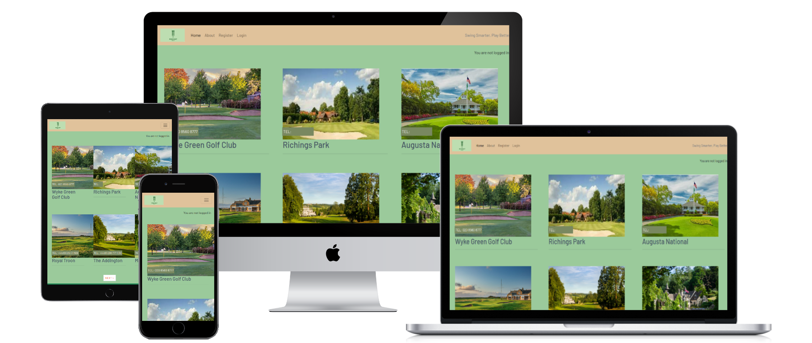

<!-- START doctoc generated TOC please keep comment here to allow auto update -->
<!-- DON'T EDIT THIS SECTION, INSTEAD RE-RUN doctoc TO UPDATE -->
**Table of Contents**  *generated with [DocToc](https://github.com/thlorenz/doctoc)*

- [Course guide](#course-guide)
  - [Planning](#planning)
  - [Requirements](#requirements)
  - [User Stories](#user-stories)
    - [View each golf hole guide in ascending order](#view-each-golf-hole-guide-in-ascending-order)
      - [As a golfer I can view each hole description so that I can strategise how to play each hole](#as-a-golfer-i-can-view-each-hole-description-so-that-i-can-strategise-how-to-play-each-hole)
    - [Par and yardage](#par-and-yardage)
      - [As a golfer I can see the par and yardage so that I can plan my shots effectively](#as-a-golfer-i-can-see-the-par-and-yardage-so-that-i-can-plan-my-shots-effectively)
    - [View map](#view-map)
      - [As a golfer I can a visual map or diagram of each hole so that I can understand the terrain and layout](#as-a-golfer-i-can-a-visual-map-or-diagram-of-each-hole-so-that-i-can-understand-the-terrain-and-layout)
    - [Strategy tips](#strategy-tips)
      - [As a golfer I can read strategy tips so that I can avoid common mistakes](#as-a-golfer-i-can-read-strategy-tips-so-that-i-can-avoid-common-mistakes)
    - [Account registration](#account-registration)
      - [As a golf course's resident pro I can register an account so that I can provide hole guides](#as-a-golf-courses-resident-pro-i-can-register-an-account-so-that-i-can-provide-hole-guides)
    - [Approve guides](#approve-guides)
      - [As a Site Admin I can approve or disapprove hole descriptions so that I can filter out descriptions that do not meet criteria](#as-a-site-admin-i-can-approve-or-disapprove-hole-descriptions-so-that-i-can-filter-out-descriptions-that-do-not-meet-criteria)
    - [Manage hole guides](#manage-hole-guides)
      - [As a Site Admin I can create, read, update and delete hole guides so that I can manage my guide content](#as-a-site-admin-i-can-create-read-update-and-delete-hole-guides-so-that-i-can-manage-my-guide-content)
    - [Create drafts](#create-drafts)
      - [As a Site Admin I can create draft guides so that I can finish writing the content later](#as-a-site-admin-i-can-create-draft-guides-so-that-i-can-finish-writing-the-content-later)
    - [View a course](#view-a-course)
      - [As a Site User, I can click on a course so that I can read the full text](#as-a-site-user-i-can-click-on-a-course-so-that-i-can-read-the-full-text)
    - [Read about the site](#read-about-the-site)
      - [As a Site user I can click on the About link so that I can read about the site.](#as-a-site-user-i-can-click-on-the-about-link-so-that-i-can-read-about-the-site)
    - [Add and update the about text](#add-and-update-the-about-text)
      - [As a Site Admin I can create or update the about page content so that it is available on the site](#as-a-site-admin-i-can-create-or-update-the-about-page-content-so-that-it-is-available-on-the-site)
    - [Modify or delete hole guides for a course](#modify-or-delete-hole-guides-for-a-course)
      - [As a Golf Pro I can modify or delete my comments on a hole guide so that I can provide professional tips to players](#as-a-golf-pro-i-can-modify-or-delete-my-comments-on-a-hole-guide-so-that-i-can-provide-professional-tips-to-players)
  - [Features](#features)
  - [Code](#code)
      - [Files](#files)
      - [Code format](#code-format)
      - [Code understandability](#code-understandability)
      - [Code validation](#code-validation)
  - [Testing](#testing)
      - [Manual Testing](#manual-testing)
      - [Error I see when entering a hole number that already exists. This prevents duplicate hole numbers:](#error-i-see-when-entering-a-hole-number-that-already-exists-this-prevents-duplicate-hole-numbers)
      - [Differences Between Manual and Automated Testing](#differences-between-manual-and-automated-testing)
      - [Console](#console)
      - [Accessibility](#accessibility)
      - [HTML](#html)
      - [CSS](#css)
  - [Bugs](#bugs)
    - [The navbar was not visible as I scrolled the HTML page:](#the-navbar-was-not-visible-as-i-scrolled-the-html-page)
    - [Value error HttpResponse object returning none:](#value-error-httpresponse-object-returning-none)
    - [There was no space between hole guides in the HTML page:](#there-was-no-space-between-hole-guides-in-the-html-page)
    - [I encountered this error:](#i-encountered-this-error)
    - [Unfixed Bugs](#unfixed-bugs)
  - [Deployment](#deployment)
    - [Setup Instructions](#setup-instructions)
      - [Install Django](#install-django)
      - [Collect static files](#collect-static-files)
      - [Run Development Server](#run-development-server)
      - [Access the site](#access-the-site)
    - [Version Control](#version-control)
  - [Wireframes](#wireframes)
    - [Home page](#home-page)
    - [Course detail](#course-detail)
    - [About page](#about-page)
    - [Signin page](#signin-page)

<!-- END doctoc generated TOC please keep comment here to allow auto update -->

# Course guide

This project demonstrates the use of **Django Template Language (DTL)** to build a reusable base layout with Bootstrap for styling. The base template provides a consistent navigation bar, footer, and message display system across all pages.

## Planning

-   The site owner's goal is to create an ergonomically presented site that allows amateur golfers to plan their course strategy prior to playing. Golf pros are invited to impart their knowledge of the nuances of each hole on golf courses they have played and know well.

## Requirements

-   The site owner wants readers to enjoy using the site. With that in mind the pages should be visually appealing at the same time simple to use.

-   The site should be responsive, adapting to all screen sizes.

-   Golf pros should be allowed to change their own hole guides in line with how the golf course changes over time.



---

## User Stories

### View each golf hole guide in ascending order
#### As a golfer I can view each hole description so that I can strategise how to play each hole

-   Given there are numerous holes on the course, the guide for each is listed.

-   When a user selects a course a list of guides is seen

-   Then the user sees all holes in the order in which it will be played.

### Par and yardage
#### As a golfer I can see the par and yardage so that I can plan my shots effectively

-   The par for each hole is visible.

-   The yardage to the centre per tee colour is available.


### View map
#### As a golfer I can a visual map or diagram of each hole so that I can understand the terrain and layout

-   The user can view key hazards (e.g., bunkers, water, OB)

-   The text is clear against the background map

-   The hole detail page loads successfully with HTTP status 200 and no visible rendering errors.


### Strategy tips
#### As a golfer I can read strategy tips so that I can avoid common mistakes

-   The tips are clear and concise

-   The map supports and aligns with the written guide

-   The tips provide aim points with yardages


### Account registration
#### As a golf course's resident pro I can register an account so that I can provide hole guides

-   Given an email a pro can register an account

-   Then the pro can login

-   When the pro is logged in they can add hole descriptions

### Approve guides
#### As a Site Admin I can approve or disapprove hole descriptions so that I can filter out descriptions that do not meet criteria

-   I can approve a hole description.

-   I can disapprove the description.

### Manage hole guides
#### As a Site Admin I can create, read, update and delete hole guides so that I can manage my guide content

-   Given a logged in golf pro, they can create a hole guide for the course they work at

-   Given a logged in user, they can read hole guides for the course they are about to play

-   Given a logged in golf pro, they can update a hole guide

-   Given a logged in golf pro, they can delete a hole guide

### Create drafts
#### As a Site Admin I can create draft guides so that I can finish writing the content later

-   Given a logged in user, they can save a draft hole guide

-   Then they can finish the content at a later time

### View a course
#### As a Site User, I can click on a course so that I can read the full text

-   When a course title is clicked on a detailed view of the course is seen.

### Read about the site
#### As a Site user I can click on the About link so that I can read about the site.

-   When the About link is clicked, the about text is visible.

### Add and update the about text
#### As a Site Admin I can create or update the about page content so that it is available on the site

-   The About app is visible in the admin panel.

### Modify or delete hole guides for a course
#### As a Golf Pro I can modify or delete my comments on a hole guide so that I can provide professional tips to players

-   Given a logged in pro, they can modify their comment

-   Given a logged in pro, they can delete their comment

---

## Features

The site has 6 different course divs per page. Each div has a visually appealing signature picture of the course. A visitor clicks on the course name to find the hole guides. They can then view each hole in ascending order in a simple, clean course detail page. The minimal look complements how simple it is to find the information you need. There are 3 types of user; superuser, editor then reader. Golf pros will be given editor access. Readers are amateur golfers who will be able to register their logins and view the guides.
Their is an about page that allows users to find out more about the creator.

-   Clear Navigation: Easily navigate through different sections of the website. Links will appear within the navbar depending on authentication status. Register and Login appear for anonymous users. Logout links are for logged in users.
-   Responsive Design: The site adapts gracefully to various screen sizes, ensuring optimal usability whether you're browsing on a desktop, tablet, or mobile device. I used Bootstrap 5 integration for responsive design.
-   I used the Django messages framework to provide interactive feedback triggered by user actions.
-   Template content is injected using Django 

---

## Code

#### Files

-   Files are grouped in directories by file type
<pre><code>
capellano-milestone3 % ls  *  
db.sqlite3		manage.py		README.md
env.py			Procfile		requirements.txt

__pycache__:
env.cpython-312.pyc	env.cpython-39.pyc

about:
__init__.py	admin.py	migrations	templates	urls.py
__pycache__	apps.py		models.py	tests.py	views.py

calc:
__init__.py	admin.py	migrations	templates	urls.py
__pycache__	apps.py		models.py	tests.py	views.py

capellano_acme:
__init__.py	asgi.py		urls.py
__pycache__	settings.py	wsgi.py

courseguide:
__init__.py	apps.py		migrations	templates	views.py
__pycache__	fixtures	models.py	tests.py
admin.py	forms.py	signals.py	urls.py

documentation:
all-devices-black.png

hole_images:
hole1Addington.png

static:
css	images	js

staticfiles:
admin		css		js
cloudinary	images		summernote

templates:
account		mfa		socialaccount
base.html	openid		tests
</code></pre>


#### Code format

-   VS code automatically indents HTML, Javascript and CSS to ease readability.

```

for (let button of deleteButtons) {
  button.addEventListener("click", (e) => {
    let holeId = e.target.getAttribute("hole_id");
    deleteConfirm.href = `delete_hole_guide/${holeId}`;
    deleteModal.show();
  });
}

```
#### Code understandability

-   Copious amounts of comments to explain what the code is doing and why.

```
@login_required
def course_detail(request, slug):
    """
    Display an individual :model:`courseguide.Course`.

    **Context**

    ``course``
        An instance of :model:`courseguide.Course`.

    **Template:**

    :template:`courseguide/course_detail.html`
    """

    queryset = Course.objects.filter(status=1)
    course = get_object_or_404(queryset, slug=slug)
    hole_guides = course.holes.filter(approved=True).order_by('hole_number')
    hole_count = course.holes.filter(approved=True).count()

```

#### Code validation

-   Python code was run through a Linter to analyze code and flag programming errors, bugs, stylistic errors and suspicious constructs.


-   Javascript was run through JSHint without ES6 checks.


## Testing

#### Manual Testing

-   In addition to automated testing, this project has also been manually tested to ensure everything works as expected. Here are the steps for manual testing:

Open the site in a web browser. Login as an editor. Select a course I want to add to. Add a hole guide. Logout then login as the approver. Go to the admin page. Approve the new hole guide. Logout then login as the editor of the hole.  Check the hole appears. Check the editor can make changes. Check the editor can delete the hole guide. Test the read only user can view the hole guides.

| Feature          | Action                    | Expected result                           | Tested | Passed | Comments |
| ---------------- | ------------------------- | ----------------------------------------- | ------ | ------ | -------- |
| Home             | Click on the "Home" link  | The user is redirected to the main page   | Yes    | Yes    | \-     
| "Course detail" | Click on a course name | The course detail page opens  | Yes    | Yes    | \-       |
| "Edit" button    | Click on "Edit" button    | Form is populated with guide details | Yes    | Yes    | \-       |
| "Delete" button    | Click on "Delete" button    | Modal pops up to confirm deletion | Yes    | Yes    | \-       |

#### Error I see when entering a hole number that already exists. This prevents duplicate hole numbers:

```
IntegrityError at /augusta-national/
duplicate key value violates unique constraint "courseguide_holeguide_course_id_hole_number_e508ec85_uniq"
DETAIL:  Key (course_id, hole_number)=(4, 3) already exists.
Request Method:	POST
Request URL:	http://127.0.0.1:8000/augusta-national/
Django Version:	4.2.22
Exception Type:	IntegrityError
Exception Value:	
duplicate key value violates unique constraint "courseguide_holeguide_course_id_hole_number_e508ec85_uniq"
DETAIL:  Key (course_id, hole_number)=(4, 3) already exists.
Exception Location:	/Library/Frameworks/Python.framework/Versions/3.9/lib/python3.9/site-packages/django/db/backends/utils.py, line 89, in _execute
Raised during:	courseguide.views.course_detail
Python Executable:	/usr/local/bin/python3
Python Version:	3.9.13
Python Path:	
['/Users/amitkapila/Documents/vscode-projects/capellano-milestone3',
 '/Library/Frameworks/Python.framework/Versions/3.9/lib/python39.zip',
 '/Library/Frameworks/Python.framework/Versions/3.9/lib/python3.9',
 '/Library/Frameworks/Python.framework/Versions/3.9/lib/python3.9/lib-dynload',
 '/Library/Frameworks/Python.framework/Versions/3.9/lib/python3.9/site-packages']
Server time:	Sat, 02 Aug 2025 15:25:58 +0000
```

#### Differences Between Manual and Automated Testing

-   Manual testing involves a person performing the tests step by step. It's useful for exploratory testing, usability testing, and ad-hoc testing, and it allows for human observation to find issues automated tests might miss.

-   Automated testing involves writing scripts to perform the tests automatically. It's useful for regression testing, load testing, and repetitive tasks, and it's more reliable and faster for large codebases or long-term projects.

-   Both types of testing are important and have their own strengths and weaknesses. A good testing strategy usually involves a combination of both.


#### Console

-   Manual testing does not generate internal errors on the page or in the console as a result of user actions.

-   

#### Accessibility

-   I used Lighthouse within the Chrome Developer Tools to allow me to test the performance, accessibility, best practices and SEO of the website. I confirmed that the colours and fonts are easy to read and that the site is accessible.
-   **INDEX PAGE**  
    

-   The website was tested on Chrome, Mozilla, Edge and Safari browsers with no problems found.
-   Links: Tested and confirmed that each link refer to each page, worked as expected,and redirecting the user between the pages 


#### HTML

-   [HTML Validator](https://validator.w3.org/#validate_by_upload) was run on each page of the project. A lot of errors were found but fixed.    

-   Now there are several errors specifically "Error: Attribute secure not allowed on element img at this point" & "Trailing slash on void elements". Since these are generated by the template code I could not change it.

```

 
    

```
-   I added data- to the hole_id attribute as the details page was showing the following issue: 

-    Thereafter the validator reported "Document checking completed. No errors or warnings to show".

#### CSS

-   [Vendor prefixes](https://autoprefixer.github.io/) Used Autoprefixer to parse the CSS and add vendor prefixes.
-   [CSS Validator](https://validator.w3.org/#validate_by_upload) no syntax errors were identified.
    


---

## Bugs

###   The navbar was not visible as I scrolled the HTML page:

I adjusted the code to use fixed-top.

```
<nav class="navbar navbar-expand-lg navbar-light bg-navbar fixed-top">
```

This way it is always visible even if you scroll to the bottom. However it took up vertical space, so I added padding to the top of the page content to avoid it being hidden under the navbar. I used DevTools to work how out how much padding to use based on the height of the nav bar:

```
body {
    background-color: #F9FAFC;
    font-family: 'Barlow', sans-serif;
    padding-top: 76px; /* Adjust depending on your navbar height */
}

```

---

###   Value error HttpResponse object returning none:

ValueError at /manor-house/delete_hole_guide/23/
The view courseguide.views.hole_guide_delete didn't return an HttpResponse object. It returned None instead.

-   I knew that Django views must return an HttpResponse. I could see the view function hole_guide_delete _did_ have the required response code.

```

 if hole_guide.author == request.user:
        hole_guide.delete()
        messages.add_message(
            request,
            messages.SUCCESS,
            "Your hole guide has been deleted."
            )
    else:
        messages.add_message(
            request,
            messages.ERROR,
            "You do not have permission to delete this hole guide."
        )
        return HttpResponseRedirect(reverse('course_detail', args=[slug]))

```

-   I then deducted that the error was caused by the return statement being in the same column as the else code. I had to restructure the code. I moved the return so that it was on the same column as the if-else blocks. That way one always ends with a return HttpResponseRedirect(...), regardless of which branch the logic goes down.

---

###   There was no space between hole guides in the HTML page:

I wanted to have more space between li elements in the HTML page.

-   Since I was using Bootstrap I wanted to use similar code. I employed the *mb-4* class to be consistent

```
                     
                    <li class="mb-4">
                        <h3>Hole {{ hole.hole_number }}: {{ hole.name }}</h3>

```

---


###   I encountered this error:

Exception Type:	RuntimeError
Exception Value:	
You called this URL via POST, but the URL doesn't end in a slash and you have APPEND_SLASH set. Django can't redirect to the slash URL while maintaining POST data. Change your form to point to 127.0.0.1:8000/manor-house/edit/21/ (note the trailing slash), or set APPEND_SLASH=False in your Django settings.

I add a slash to `edit/${holeId}/:

```
    // Update form fields with the retrieved content
    submitButton.innerText = "Update";
    holeForm.setAttribute("action", `edit/${holeId}/`);
  });

```

---

### Unfixed Bugs

All bugs identified were fixed

## Deployment

### Setup Instructions

#### Install Django

```
pip3 install django
```

#### Collect static files

```
python3 manage.py collectstatic

```

#### Run Development Server

```
python3 manage.py runserver

```

#### Access the site

-   Open http://127.0.0.1:8000 in your browser.

### Version Control

-   The site was created using VS Code as IDE and pushed to Github to the remote repository 'capellano_acme'.
-   Git commands were employed extensively during development to push the code to the remote repository. Prior to pushing the code to the repo I had to make sure to set Debug=False in the project's settings.py before deploying it to the server else someone can hack the development server and garner sensitive information from the logs. The sequence of Git commands utilized includes:
    -   **git add .**: This command adds the files to the staging area, preparing them for commitment.
    -   **git commit -m "commit message"**: It commits the changes to the local repository queue, marking them as ready for the final step.
    -   **git push**: This command is executed to push all committed code to the remote repository on Github.
    ### Deployment to Github pages
    The site was deployed to GitHub pages. The steps taken to deploy are as follows:
    1. Log in to [Github](https://github.com/);
    2. Navigate to [AmitKapilaCodeIns/capellano_acme](https://github.com/AmitKapilaCodeIns/capellano_acme) in the list of repositories;
    3. In the GitHub repository, navigate to the Settings tab;
    4. In Settings scroll down to GitHub pages which opens in a new page;
    5. From the source section drop-down menu, select the Master Branch;
    6. Once the master branch has been selected, the page is automatically refreshed and a display indicates the successful deployment and the link to the address.
    
    The live link can be accessed here: [Rocket Guides](https://courseguide-c34cc0b394d2.herokuapp.com)
    1. Open your project's Heroku dashboard and click the deploy tab and Deploy Branch.
    2. Open the app.

    ### Cloning Repository Code locally
    -   To clone the repository code locally, follow these steps:
    1. Navigate to the Github repository you wish to clone;
    2. Click on the "Code" button located above all the project files;
    3. Select "HTTPS" and copy the repository link;
    4. Open the IDE of your choice and paste the copied git URL into the IDE terminal;
    5. Press Enter to execute the command;
    6. The project will now be created as a local clone in your IDE.

---

## Wireframes

-   These wireframes were created using simple ASCII-style text during the Scope Plane part of the design and planning process for this project. The site was developed with the Desktop layout method first. The wireframes were therefore drawn with that thought in mind and adapted alongside project changes. , Second picture: Coaching page, Third picture: Member page, Fourth picture: Thank you page.
### Home page
-   
---
### Course detail
-   
---
### About page
-   
---
### Signin page
-   
---


The MIDDLEWARE section helps you with security.

Since we are making an application we want a database. We will use PostGres

The urls.py file is for the django admin site, but also the urls for your apps.

In Django we have a project (capellano_acme) but I want to create apps within this project. These apps will handle the
features that I want for my project. We already have the admin feature but we want other things like the login app.

Each app has it's own urls.py that handles the mapping of requests.

We will be using templates since that allows us to have dynamic content, within a fixed layout.

Because Django provides 'django.middleware.csrf.CsrfViewMiddleware', middleware we can use this  in our templates

Models
Hole model, Guide model, User model track pro who wrote it. Guide model link to Hole model so that we know which hole has had a guide added to it. The hole and guide models need to link the user model so we know who wrote what.

Hole guide model
Key | Name | Type | Extra info |
--- | --- | --- | --- |
FK | course | course Model | cascade on delete |
FK | author | User model | cascade on delete |
--- | hole_number | IntegerField |  |
--- | name | CharField | --- |
--- | Par | PositiveSmallIntegerField |  |
--- | Yardage | PositiveIntegerField |  |
--- | guide | TextField ||
--- | image | ImageField | |
--- | Approved | BooleanField | --- |
--- | created_on | DateTimeField | auto_now_add

Course intro model
Course_name and slug values should be unique to avoid having courses of the same name confusing your users. In Django, the slug is what you'll use to build a URL for each of your posts.
Key | Name | Type | Extra info |
--- | --- | --- | --- |
--- | Course_name | Char(200) | Unique |
--- | Slug (unique) | SlugField | --- |
FK | Author | User Model | cascade on delete |
--- | Content | TextField |  |
--- | created_on | DateTimeField | auto_now_add
--- | Status | Integer |  |

Part 1 - env.py:
By adding the env.py file to .gitignore, it will not be tracked by git or pushed to GitHub. This keeps our secret information safe by not having it publicly available.
In the env.py file, the DATABASE_URL value was copied from our PostgreSQL from Code Institute email when we created our database instance.
The os.environ.setdefault command sets an environment variable in the local operating system. We supply the variable name and value in the parentheses. In our case, this is called DATABASE_URL and the value is the URL we copied from our PostgreSQL from Code Institute email.

Part 2 - settings.py:
The dj_database_url import is used to convert the database URL we copied from our PostgreSQL from Code Institute email into a format that Django can use to connect to an external database server.
The code uses another method from the os module to check if the env.py file path exists. If it does, then it will be imported. If it does not exist, the env import will not be attempted so that no error will occur. For example, when the app runs on Heroku, there will be no env.py file to load, as described above.
This code uses os.environ.get to get the value stored in the DATABASE_URL environment variable. The value is then parsed using dj_database_url to put it in a format that Django can use.
Part 3 - Heroku:
We need to set the environment variable separately on Heroku because, as we mentioned, our env.py file is not pushed to GitHub. This means that when our app is running on Heroku, it won't be able to import the database URL settings. We'll go into more detail on the reasons behind this below.

Keeping secrets secret

Why do we set the DATABASE_URL variable in the environment rather than in the code? In the Django world, the DATABASE_URL is considered a secret. But why is that? It's because it contains sensitive information about your database, including the username, password, and database name. Keeping it a secret ensures the safety of your database from unwanted access. That's why we don't set it in code or allow our env.py file to be pushed to GitHub. Anyone with these details would have full access to your database. That is why we use an environment variable, which is just stored in memory on Heroku and is never shown to anyone else.


The fields and attributes match as follows:
The title attribute with field type CharField() generates a single-line form input type text. It accepts Python string data type.
The slug attribute with field type SlugField() also generates a single-line form input type text. It accepts Python string data type. A slug is a short label only containing letters, numbers, underscores or hyphens. You would use one as a semantic URL path rather than an integer or database row ID.
The author attribute with field type ForeignKey() generates a select drop-down list prepopulated by User database table entries. In this case, as User instances are strings, then string data type options are accepted. This value will ultimately be used to display the author's name beside the post on the webpage.
The content attribute with field type TextField() generates a multi-line textarea input. It accepts Python string data type.
The status attribute with field type IntegerField() corresponds to the select drop-down list of Draft or Published. The IntegerField field type normally generates a number picker input, but this default has been overridden to display a select drop-down with string options.
There is no Created on date picker input as we added the option auto_now_add=True, so the time used in the database table will be the computer's time when the Save button is pressed to submit the form.
The option choices use the STATUS constant to limit the integer choice to 0 or 1 and has mapped these two integers to "Draft" and "Published". Therefore, the dropdown option values are "Draft" or "Published" rather than 0 or 1. These strings are more human-readable than the integers.
Choices are a sequence of 2-tuples where the first value is stored in the database, and the second is displayed as the option in the select form input.
You can also see that the default option for the database is 0, which is an integer.
The model naming convention is to use the singular because the admin panel pluralises the model Post to the form Posts. If you named the model Posts, the admin panel would have Postss. You can also see the model User is pluralised to Users in the admin panel.

The blog project has multiple custom models, such as Post and Comment. It will also incorporate some of Django's built-in models, such as User, Group and Permission. These models and their attributes define the structure of, and communicate with, the database used for your blog.

Although Django does not provide an app-level urls.py file by default, it is good to separate the urls.py files into separate apps because, as stated, this follows the Django design philosophy of loose coupling. Having one urls.py file per app keeps our apps more modular and independent. It also means that we can more easily change URLs without breaking our project. It's good to keep your apps as self-contained as possible. This enables an app from one project to be dropped into another.

In the index.html the for loop iterates over the course_list object. 



This object is passed into the template by the generic ListView, and contains the contents of the queryset that we defined earlier.

class Course***List***(generic.ListView):
    queryset = ***Course***.objects.all()  # Only show published courses
    template_name = 'courseguide/index.html'  # Template to render the course list


This if statement checks to see how many times our for loop has run. If the counter is divisible by three, then it inserts another closing div tag and a new div with the class of row. This is so that we have a maximum of three posts per row on the homepage

In the navigation section of base.html, there's an anchor tag with the class of "navbar-brand", which links back to the homepage. What do you notice is different about ? Where do you think the value for 'home' comes from?

<a class="navbar-brand" href=""><span class="brand">c<span class="red-o">o</span>de<span
                        class="thin">|star</span></span></a>

The href is a DTL tag. Inside the tag, we have url and a reference to 'home'. The url tag returns an absolute path reference which is a URL without the domain name. It does this, in our example, for the URL named 'home'. Where does it get this name from? Take a look at the blog/urls.py file, and you will see that our main view has the name of home. So, when Django encounters a url tag, it looks up the name of the URL and inserts it for us.

urlpatterns = [
    path('', views.CourseList.as_view(), name='home'),  # URL for the course list view
]

At the top of the base.html we are assigning the 'home' URL to a variable named home_url, which is what the as keyword does. One last thing. The curious among you might be wondering why we couldn't just say {% if request.path ==  %}? Why did we have to assign it to a variable? All excellent questions, which I'm sure you were thinking. The reason is that url itself is a tag, so we can't nest a tag inside another tag, so we had to assign the output of url to a variable.

 

Then our if statement. It compares request.path, which is our current URL, with the home_url variable. If they're the same, then it inserts the word active into the class names.

   <a class="nav-link active" 

But, let's back up a second - what's this request.path business? Where did that come from? Remember that we said a view takes a web request and returns a web response? We have access to the contents of the request object in our views and templates. In this case, request.path is a string representing the full path to the requested page, not including the domain. Sound familiar? It's the same kind of string that is returned by the url tag. We can use this kind of pattern matching and variables in our own projects to improve the UX.

We are using the course_list object. This was created using a bit more magic from the generic ListView in our views.py file. 

class CourseList(generic.ListView):
    queryset = Course.objects.all()  # Only show published courses
    template_name = 'courseguide/index.html'  # Template to render the course list

Django determines this based on the model name (Course) and the view type (List). In this case, the Course model and the generic ListView type.

As we iterate we assign the results to the course variable. This variable is an object containing one single record from our database. We can then display the values using the object name and the field name separated by a dot, course.author, for example.

The benefits of the url tag

The url tag is useful because it helps with the DRY principle. If the URL scheme for your project changes, then you don't need to change every page that has a static URL, like you would in front-end projects. Use named URLs in your urls.py and template files, and you won't need to worry about URLs breaking.


Disabling COLLECTSTATIC

One advantage of using a hosting provider like Heroku is that it knows how to deploy a Django project. As such, it automatically runs collectstatic for us, which means we don't need to do it ourselves. When the DISABLE_COLLECTSTATIC environment variable is set in Heroku, however, then it will not run collectstatic when deploying our project. This is why your Heroku-hosted admin dashboard has been unstyled up to now. You can even see collectstatic is skipped in the build logs.

By removing DISABLE_COLLECTSATIC, Heroku will manage our static files for us automatically every time it deploys. So, from now on, you will not need to run collectstatic manually unless you choose to keep DEBUG set to False in your development environment or if you are deploying to a different hosting provider.

Which is all wonderful and lovely, but why? Why do we need whitenoise, and why can't Django just serve the static files for us as it does in our development environment?

Quite simply, Django does have the ability to serve these files, but its server is not suitable for a production environment. runserver lacks the scalability and security required for a production deployment. In the development environment it happily serves them for us, so we can test our project, but for production we need gunicorn to serve the project and whitenoise to serve the static files.

Middleware?

The name sounds like it came directly out of Tolkien, but the concept behind it is very simple. Remember how we said a view takes a web request and returns a web response? Well, middleware also sits between the request and the response, a bit like a specialised kind of view.

Middleware can modify a request prior to it hitting the view code and then modify the response after the view has created it.

Web request explained using a veggie burger
If the web request and response are like the two halves of a burger bun, then the view is your delicious burger (or veggie burger for me), and middleware is like the lettuce, tomato and cheese that goes around the burger. The primary focus of the meal is the burger and bun, but the other things make it so much more tasty!

Similarly, the request, response and view are the most important things, but the middleware adds additional functionality. In the case of Whitenoise, it modifies the response to load the static files from the staticfiles directory and serve them when a user visits our site.

Note: Middleware often needs to be loaded in a particular order. The documentation for a piece of middleware will tell you where it needs to be in the MIDDLEWARE list in settings.py.

And finally, .python-version

In the text steps, you created a file named python-version. If Heroku finds this file, it will use it to determine which version of Python to run your project with. Using the same version of Python in development and hosted environments means that your application should behave the same in both.

Heroku periodically updates the list of supported Python versions. You can see the current list in the Heroku documentation. If your project needs to be redeployed later, it would be worth checking that your Python version is still current.

Within the index.html template's for-loop, update the anchor element to point to the post_detail view.
<a href="" class="post-link">
Note: This uses the name, post_detail from the urlpattern and the slug variable value is accessed with the same dot notation as seen for author, title, excerpt and so on.

Explanation
A string is appended to the end of the URL path that uniquely identifies the blog post. This string is the slug, which is the blog title in lowercase, with all spaces replaced with dashes and all punctuation removed.
In the href, we constructed a DTL url tag, i.e. . It contains post.slug, and the urlpattern name of 'post_detail'. As the anchor is inside the for-loop, post.slug is this blog post's slug value.
In the blog/urls.py file, you can see the name of 'post_detail', which the template's anchor element was pointing to. Also, in the urlpattern is the name of the view it points to. Note that as this is a function-based view, no as_view() method is required, as we saw with class-based views. The critical component of the URL pattern for this topic is the part enclosed in angle brackets, denoted as <slug:slug>. This is where the slug value is passed from the template's URL tag. This urlpattern creates a url path of the domain path plus the slug value.
Blog post URL path

The slug is used for the blog post path as it uniquely identifies the post and contains only characters valid for a URL. In our Post model, we defined that the title and slug are unique, with unique=True, so we can be sure that the slug will only match one blog post. A slug is also more semantic than another unique identifier, such as the database table row number, which improves your site's ranking in search engines.

Passing the argument from the template

The DTL url tag syntax allows us to pass in an argument in addition to the urlpattern name. As the anchor element is inside the for loop, we can use post.slug as the argument, which gives us the slug value for the specific post in that iteration of the post_list object. This syntax is the same dot notation you used to access the post author, title and excerpt.
URL path and arguments
path('<slug:slug>/', views.post_detail, name="post_detail"),
In the post_detail URL path, the argument value from the url tag is then passed into <slug:slug>. The slug path converter before the colon defines the data type as a slug, and the slug after the colon is the post.slug value passed from the template. You see this value in the URL path in the browser bar.
If you had a human resources web app that identified workers by their ID badge number, then you could use the syntax <int:id_badge> to pass the integer argument to the URL path. Alternatively, a car mechanics web app identifying cars by their alphanumeric registration plate could do so with <str:reg>.

Explanation
The queryset applies a filter on the database to get only posts with a status of 1, which, from the STATUS constant in models.py, we know is mapped to "Published".
This queryset is the same as used in the PostList class-based view so that only published posts are displayed.
post_detail(request, slug)
The slug parameter gets the argument value from the URL pattern named post_detail.
path('<slug:slug>/', views.post_detail, name="post_detail"),
The slug value is unique, so only one post in the database matches this argument.
Python functions always have a return. The path to the template file is included in the view function return.
return render(
    request,
    "blog/post_detail.html",
    {"post": post},
)
Function-based view parameters
def post_detail(request, slug):
    queryset = Post.objects.filter(status=1)
    post = get_object_or_404(queryset, slug=slug)
    return render(
      request,
      "blog/post_detail.html",
      {"post": post},
  )
Function-based views are more verbose than class-based ones. A view function takes a web request and returns a web response. A function-based view always passes in the request object as the first argument to the view. Convention dictates that we call this parameter request, but in fact, we could call it anything we want. In addition to the mandatory HTTP request object, the post_detail view has also been given a slug parameter. 
The slug parameter exists so we can pass in the unique slug argument value from the URL for the one post we want to view.

Post data object
post = get_object_or_404(queryset, slug=slug)
In the same way we used render() as a shortcut to load data to a template and return it, we can use the shortcut get_object_or_404() to get data or raise a Http404 error if the data object does not exist.
By passing the queryset and the slug argument to get_object_or_404() helper function, we only get the one post returned with that unique slug. If there is a communication issue with the database, or an incorrect URL is manually typed in, and a post matching the slug is not found, then we will get a 404 error returned.

404 resource
In our view, we've assigned this result to the variable post.

The view response

We then add this variable to the dictionary in the render helper function. This {'post': post} object is then available for use in the template as the DTL variable {{ post }}. The next topic will go into much more detail about this object.
return render(
        request,
        "blog/post_detail.html",
        {"post": post},
    )
The response our view is returning is the contents of a webpage containing one post. In this view, we pass the request object, the path to the template and a dictionary of data to the Django render() helper function.
The render function then returns an HttpResponse object with the result of the template and the rendered data from the dictionary.

Explanation
Part 1: Passing data from the view
In our views file, we set the name of the object as post, e.g. {"post": post}. So, in post_detail.html, we can now access its attributes, which are the fields in our model, to insert blog post data, such as post.title, post.content etc. There are a lot of references to post, so we'll cover what they are below.
As shown in the topic image, the object was being passed to the template as a Python dictionary, {"post": post}. We retrieved one single blog post, stored it in a variable called post and passed that through to the template in a dictionary where both the value and key name was, you guessed it, post. This is called context and it is how you pass data from your own views to a template.

Entering a hole guide using post method:


Enter a link to Desktop/restrictedHoleEntry.png

AllAuth templates

The AllAuth-provided templates are basic HTML. This look is because they expect the developer to style them based on the rest of the project. If AllAuth did include fonts and colours, they would likely clash with the styles of the project it was added to.

Template inheritance

AllAuth templates had their own account/base.html file from which all the other templates inherit. By updating the path to simply base.html, the inheritance is then from the base.html template in our project. This change gives the AllAuth templates access to the custom CSS and Bootstrap CSS/JavaScript used throughout the project.

The AllAuth templates look like the rest of the project by adding nested div elements with Bootstrap container and row and column classes. The colours of the background and buttons are from the custom CSS file.

Retrieving the hole guides

As can be seen in the topic image, we retrieve all the guides linked to the selected Course using the holes object. But, where does this holes object on our Course come from, though? If you check models.py, you won't see it in the Course model.

The important thing to remember is that this is a ForeignKey, a many-to-one, relationship. One course will, hopefully, have many hole guides. The course field in the HoleGuide model stores the ID of the Course that a hole guide is linked to. For example, if guides 1, 2 and 3 are all about Course 1, then they will all have the same Foreign Key value of course = 1.

While the Course model doesn't have a field named hole_guides, the related_name in our HoleGuide model sets up a logical link, effectively creating this association, as you can see in the image and the code.
course = models.ForeignKey(
    Course,
    on_delete=models.CASCADE,
    related_name="holes"
)
So, when we use course.holes.all(), it will return all holes related to the selected course by using related_name="holes".
This is what is called a reverse lookup. We don't access the HoleGuide model directly. Instead, we fetch the related data from the perspective of the Course model.

n the blog/forms.py file.
We created a class called CommentForm that inherited from Django's forms.ModelForm class. Because this class is inherited from a built-in Django class, we can simply use the Meta class to tell the ModelForm class what models and fields we want in our form. form.ModelForm will then build this for us.
We included the body field for the user to complete. This field was imported from the Comment model . We didn't need to include the other fields because the post, user and created_on fields in our model are filled in automatically, and the approved field is managed by the superuser.
In the blog/views.py file:
Ignoring the if block for now, we import the CommentForm class from .forms at the top of the file. We then assign it to a variable named comment_form and add that to our context for when the template is being rendered.
In the post_detail.html template:
At the top of the file, we load the crispy_forms_tags. Then, we simply used a Django Template Language variable to render the form and used the | crispy filter to get Crispy Forms to style it.
If you remove the | crispy filter, then the form is rendered as a standard HTML form. We'll explain more about what Crispy Forms actually does below.
This is another way Django helps to protect us from cross-site attacks. We discussed some of these earlier in the course when we set the CSRF_ALLOWED_HOSTS setting. If you remove the  tag then Django will return an error when you try to submit the form. We'll explain why in more detail below. Make sure to add your CSRF token back into your code before you continue.
Forms are better when they're Crispy

So, what does Crispy Forms actually do? In our settings.py file, we told Crispy Forms to use bootstrap5 as our template pack:
CRISPY_ALLOWED_TEMPLATE_PACKS = "bootstrap5"
CRISPY_TEMPLATE_PACK = "bootstrap5"
Therefore, when we use the | crispy filter on our form, it is rendered using Bootstrap 5 form controls and classes. As a result, we don't need to create a styled form template ourselves, which would be time-consuming.
CSRF again!

Earlier in the course, we talked about cross-site scripting and how Django helps to protect us from that using the CSRF_ALLOWED_HOSTS setting. We see another of Django's protections against cross-site request forgery in our comments form, the  tag.

This little tag needs to be added every time we render a form. When this tag is present, Django generates a unique CSRF token, which it sends along with our POST request. Django then checks that token before processing the POST request. When you removed the token or if it doesn't match what Django was expecting, then we get an error, and Django won't process the request.

Exactly how it does this is quite complicated. The critical thing to remember, though, is that you won't be able to process any POSTed forms unless you've provided a . If you have more than one form on a page, you will need this tag on each of them.

IntegrityError at /manor-house/
duplicate key value violates unique constraint "courseguide_holeguide_course_id_hole_number_e508ec85_uniq"
DETAIL:  Key (course_id, hole_number)=(1, 6) already exists.
Request Method:	POST
Request URL:	http://127.0.0.1:8000/manor-house/
Django Version:	4.2.22
Exception Type:	IntegrityError
Exception Value:	
duplicate key value violates unique constraint "courseguide_holeguide_course_id_hole_number_e508ec85_uniq"
DETAIL:  Key (course_id, hole_number)=(1, 6) already exists.
Exception Location:	/Library/Frameworks/Python.framework/Versions/3.9/lib/python3.9/site-packages/django/db/backends/utils.py, line 89, in _execute
Raised during:	courseguide.views.course_detail
Python Executable:	/usr/local/bin/python3
Python Version:	3.9.13
Python Path:	
['/Users/amitkapila/Documents/vscode-projects/capellano-milestone3',
 '/Library/Frameworks/Python.framework/Versions/3.9/lib/python39.zip',
 '/Library/Frameworks/Python.framework/Versions/3.9/lib/python3.9',
 '/Library/Frameworks/Python.framework/Versions/3.9/lib/python3.9/lib-dynload',
 '/Library/Frameworks/Python.framework/Versions/3.9/lib/python3.9/site-packages']
Server time:	Sun, 03 Aug 2025 20:54:51 +0000

To allow file uploads such as Cloudinary images via a form in your course_detail.html, you need to make two key changes:
1. Update the HTML form to support file uploads
Right now, your form is missing the enctype="multipart/form-data" attribute, which is required to handle file uploads.
Change this:

<form id="commentForm" method="post" style="margin-top: 1.3em;">
To this:
<form id="commentForm" method="post" enctype="multipart/form-data" style="margin-top: 1.3em;">
 2. Ensure your view handles request.FILES
In your views.py, wherever you're handling hole_form, make sure you include request.FILES when creating the form instance.
For example:

hole_form = HoleGuideForm(request.POST or None, request.FILES or None)
And when saving the form:
if request.method == 'POST':
    hole_form = HoleGuideForm(request.POST, request.FILES)
    if hole_form.is_valid():
        hole_guide = hole_form.save(commit=False)
        hole_guide.author = request.user
        hole_guide.course = course  # Link it to the current course
        hole_guide.save()
        return redirect('course_detail', slug=course.slug)
 3. Your ModelForm should include featured_image
In forms.py, ensure that your form includes the featured_image field:
from django import forms
from .models import HoleGuide

class HoleGuideForm(forms.ModelForm):
    class Meta:
        model = HoleGuide
        fields = ['hole_number', 'name', 'par', 'yardage', 'stroke_index', 'guide', 'featured_image']
 4. Make sure you have configured Cloudinary
In settings.py:
import cloudinary
import cloudinary.uploader
import cloudinary.forms

CLOUDINARY_STORAGE = {
    'CLOUD_NAME': 'your_cloud_name',
    'API_KEY': 'your_api_key',
    'API_SECRET': 'your_api_secret',
}
DEFAULT_FILE_STORAGE = 'cloudinary_storage.storage.MediaCloudinaryStorage'

https://youtu.be/wlYaUvfXJDc?si=5smLZ3n-6ahGstGf

<a href='https://monsterone.com/graphics/logo-templates/'>Logo Templates item created by Greenflash - https://monsterone.com</a> is where I got the template from